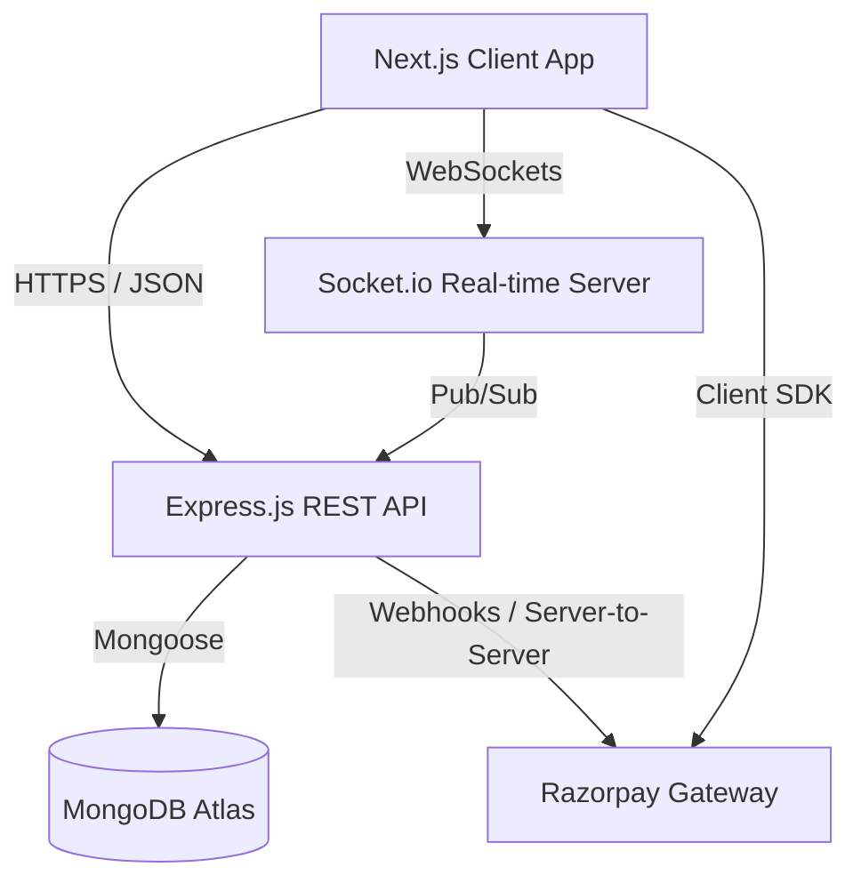
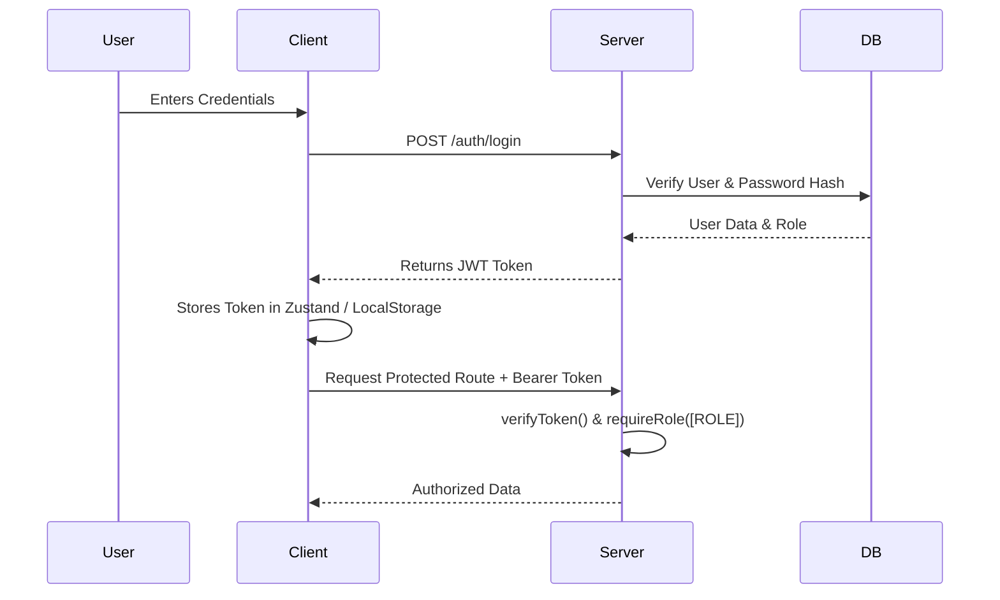

# HealOS 🏥


> **A Next-Generation Hospital Management System built with the MERN stack.**

HealOS is a comprehensive, real-time, role-based Hospital Management System designed to streamline clinical workflows, patient management, and facility operations. Built with modern web technologies, it features 7 distinct workspaces tailored to the specific needs of different hospital staff and patients.

---

## 🏗️ System Architecture

HealOS uses a decoupled client-server architecture. The frontend is a highly interactive React application powered by Next.js, communicating via RESTful APIs and real-time WebSockets to an Express.js backend.



### 🔐 Authentication Flow

The system uses stateless JSON Web Tokens (JWT) for authentication and role-based access control (RBAC).



---

## 👥 Role-Based Workspaces

HealOS provides tailored dashboards and tools for 7 different user roles:

1. **👨‍⚕️ Doctor**: Manage consultations, write persistent clinical notes, order lab diagnostics, and prescribe medications.
2. **👩‍⚕️ Nurse**: Interactive eMAR (Medication Administration), Shift Handovers (SBAR), Call Bells queue, and patient vitals tracking.
3. **💊 Pharmacist**: Real-time e-Prescription queue and medication dispensing workflow.
4. **🔬 Lab Technician**: Receive diagnostic orders, upload patient lab reports, and manage sample collections.
5. **🏢 Admin**: Facility overview, staff role management, ward capacity tracking, and clinical credential approvals.
6. **🏥 Receptionist**: Patient onboarding, billing, and appointment scheduling.
7. **🤒 Patient**: Patient portal to book appointments, view medical records, view lab reports, and pay invoices online via Razorpay.

---

## 🚀 Tech Stack Overview

### Frontend (`/client`)
- **Framework**: Next.js 14+ (React 19)
- **Styling**: Tailwind CSS v4, Framer Motion
- **State Management**: Zustand, React Query
- **UI Components**: Radix UI, Lucide Icons

### Backend (`/server`)
- **Runtime**: Node.js
- **Framework**: Express.js
- **Language**: TypeScript
- **Database**: MongoDB (via Mongoose)
- **Real-time**: Socket.io
- **Payments**: Razorpay

---

## 🏁 Getting Started

### Prerequisites
- Node.js (v18 or higher)
- MongoDB Atlas account / Local MongoDB instance
- Razorpay Account (for payment integration)

### Installation

1. **Clone the repository:**
   ```bash
   git clone https://github.com/yourusername/healos.git
   cd healos
   ```

2. **Setup Backend:**
   ```bash
   cd server
   npm install
   # Create a .env file based on .env.example
   npm run dev
   ```
   *See [server/README.md](./server/README.md) for detailed backend configuration.*

3. **Setup Frontend:**
   ```bash
   cd ../client
   npm install
   # Create a .env.local file
   npm run dev
   ```
   *See [client/README.md](./client/README.md) for detailed frontend configuration.*

---

## 🤝 Contributing
Contributions, issues, and feature requests are welcome! Feel free to check the [issues page](#).

## 📄 License
This project is licensed under the MIT License - see the LICENSE file for details.
